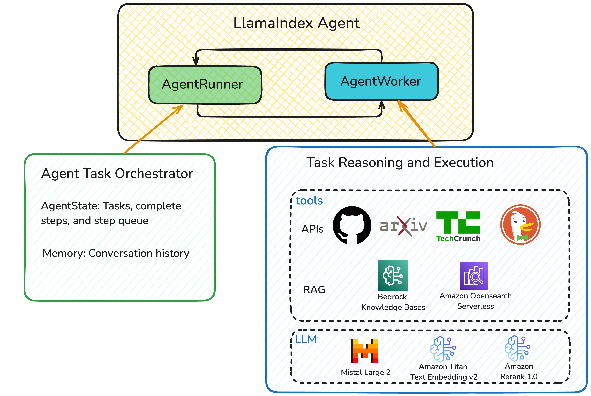

# Creating an Agentic RAG Application with LlamaIndex, Mistral and Amazon Bedrock for Advanced Knowledge Discovery

## Introduction

Agentic RAG (Retrieval-Augmented Generation) applications represent an advanced approach in AI that integrates large language models (LLMs) with external knowledge retrieval and autonomous agent capabilities. These systems dynamically access and process information, break down complex tasks, utilise external tools, apply reasoning, and adapt to various contexts. They go beyond simple question-answering by performing multi-step processes, making decisions, and generating complex outputs.

In this notebook, we demonstrate an example of building an agentic RAG application using the LlamaIndex framework. This application serves as a technology discovery and research tool, using the Mistral Large 2 model via Bedrock Converse as the LLM to orchestrate agent flow and generate responses. It interacts with well-known websites, such as Arxiv, GitHub, and TechCrunch, and can access knowledge bases containing documentation and internal knowledge.

This application can be further expanded to accommodate broader use cases requiring dynamic interaction with internal and external APIs, as well as the integration of internal knowledge bases to provide more context-aware responses to user queries.

---

## Prerequisites 🔥

- At the time of writing this notebook, the Mistral Large 2 model is only available in the `us-west-2` region.
- Create an Amazon SageMaker domain. 
- Create a SageMaker domain user profile.
- Launch Amazon SageMaker Studio, select JupyterLab, and create a space. 
- Select the instance `ml.t3.medium` and the image `SageMaker Distribution 2.3.1`, then run the space. 
- On the IAM console, create an inline policy for the SageMaker Notebook execution role and add the following JSON configuration to the policy:
```json
{
    "Version": "2012-10-17",
    "Statement": [
        {
            "Effect": "Allow",
            "Action": [
                "bedrock:Rerank",
                "bedrock:Retrieve",
                "bedrock:InvokeModel",
                "bedrock:InvokeModelWithResponseStream",
                "bedrock:ListFoundationModels"
            ],
            "Resource": "*"
        },
        {
            "Effect": "Allow",
            "Action": [
                "iam:CreatePolicy",
                "iam:AttachRolePolicy"
            ],
            "Resource": [
                "arn:aws:iam::<account_number>:role/*",
                "arn:aws:iam::<account_number>:policy/*"
            ]
        },
        {
            "Effect": "Allow",
            "Action": [
                "aoss:*"
            ],
            "Resource": "*"
        }
    ]
}
```
- Navigate to the AWS Bedrock service in the AWS console. On the left banner, select “Model access.” Click on “Modify model access.” Select the models: Mistral Large 2 (24.07), Titan Text Embeddings V2, and Rerank 1.0 from the list, and request access to these models. 


---

## Architecture

This solution uses the LlamaIndex framework to build an agent flow with two main components: [AgentRunner and AgentWorker](https://docs.llamaindex.ai/en/stable/module_guides/deploying/agents/agent_runner/). The AgentRunner serves as an orchestrator that manages conversation history, creates and maintains tasks, executes task steps, and provides a user-friendly interface for interactions. The AgentWorker handles the step-by-step reasoning and task execution.

For reasoning and task planning, we use Mistral Large 2 model from Amazon Bedrock. The agent integrates with GitHub, arXiv, TechCrunch and DuckDuckGo APIs, while also accessing internal knowledge through Bedrock Knowledge Bases and Amazon OpenSearch Serverless to provide context-aware answers.




## Next Step
Please open the notebook "mistral_agentic_rag_with_llamaindex.ipynb" and follow the instructions to build the solution. 
